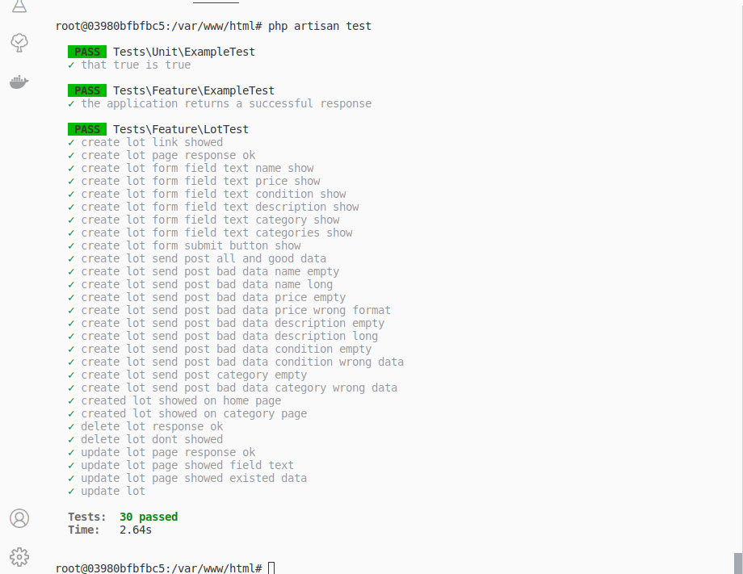
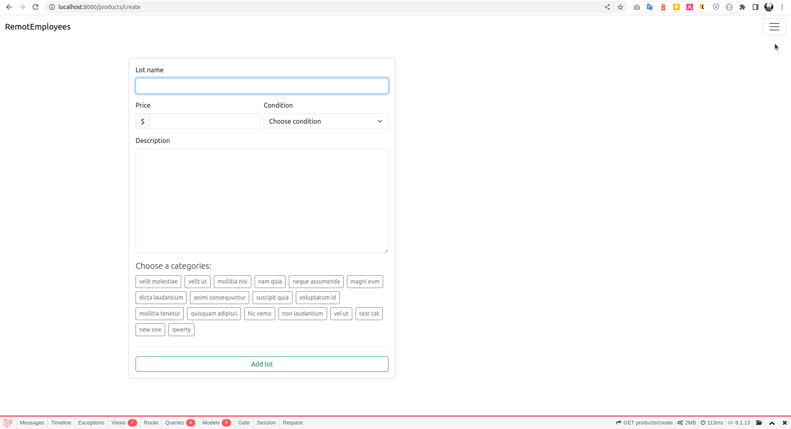
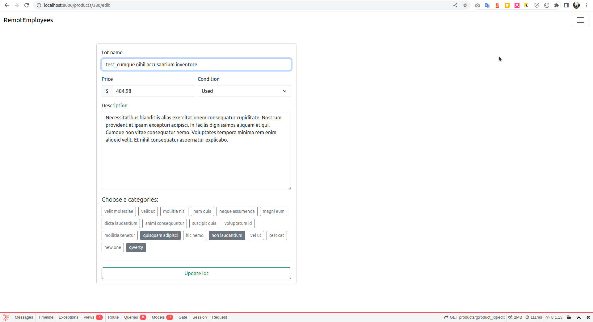
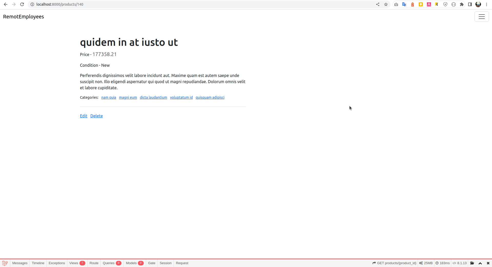
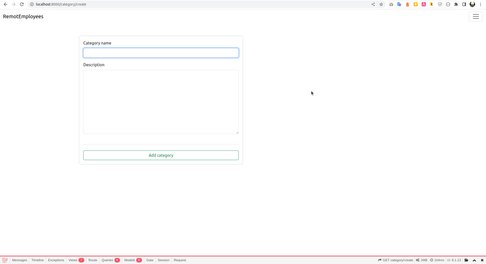
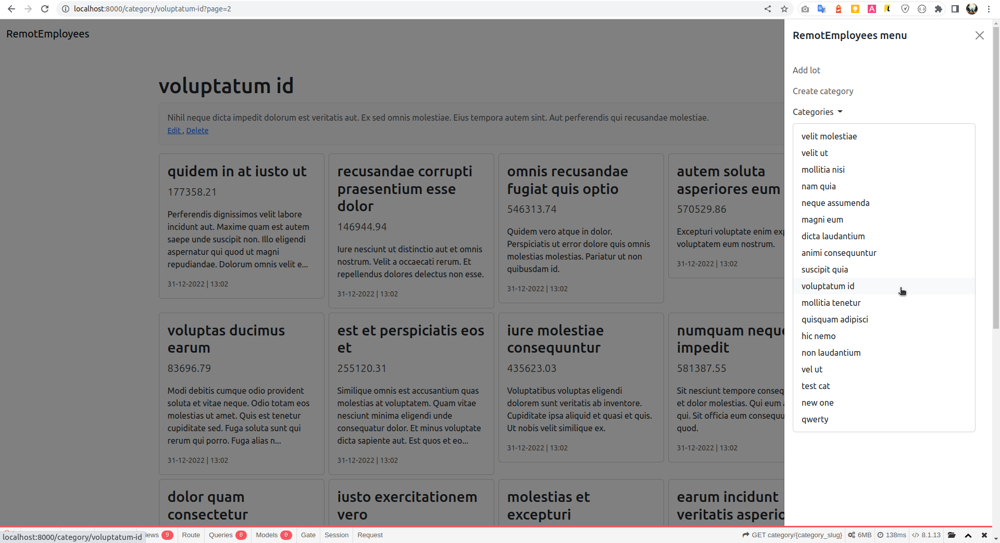
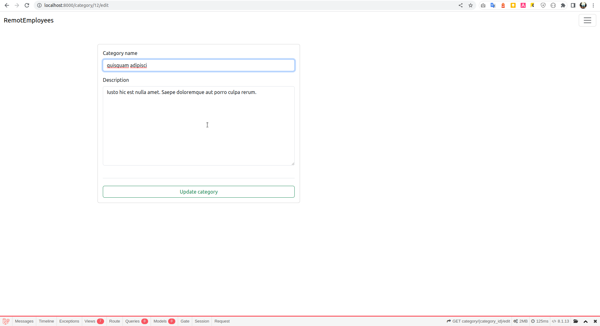

# Run project  
You should have Docker

- clone project
```
bash: git clone https://github.com/v-e-y/RemotEmployees.git
bash: git checkout dev
```

- run next commands
```
bash: composer install
bash: sail up -d
bash: sail artisan migrate:fresh --seed
```
- open your browser. Website wil`be available on address - http://localhost:8000/

- Tests
```
bash: sail artisan test
```


  

Add lot page  

  

Edit lot page  



Product page  



Add category page  

  

Category page



Edit category page  



